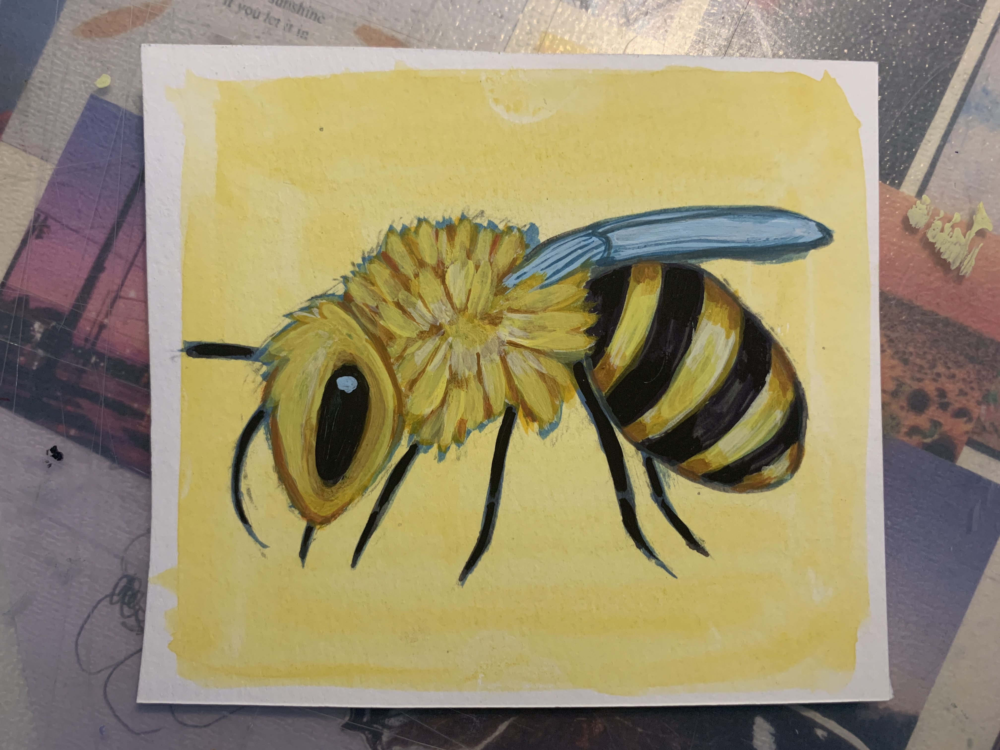
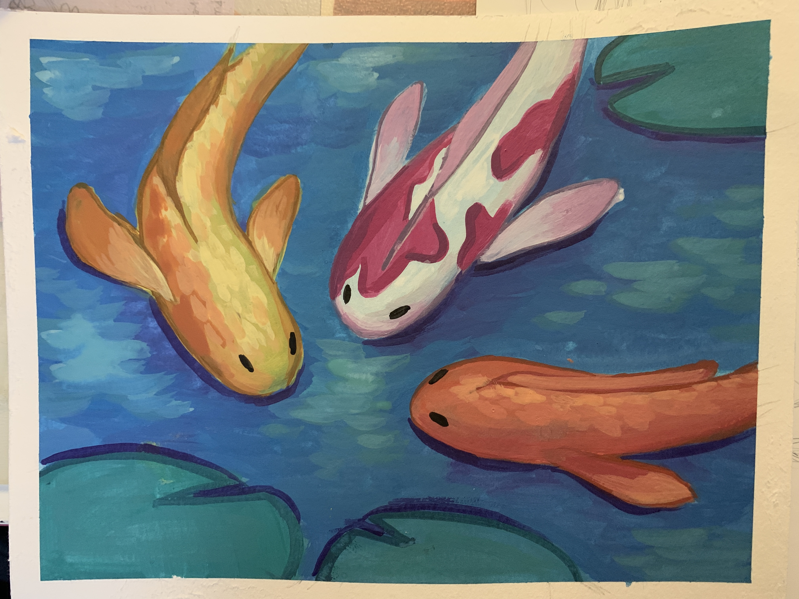

# Samantha Catacutan Illustrations
A collection of my personal artwork!
## Dog

Painted with gouache on watercolor paper.
## Princess Yue

Digitally painted on iBis Paint X.
## Taiyaki Ice Cream

Painted with gouache on watercolor paper.
## Bee

Painted with gouache and watercolor on watercolor paper.
## Chicken

Painted with gouache on watercolor paper.
## Koi Fish

Painted with gouache on watercolor paper.

---

### List of Materials I Use
- [Miya Himi Gouache Set](https://www.amazon.com/Gouache-Portable-Students-Watercolor-Painting/dp/B086TRRD7V/ref=sr_1_2_sspa?crid=2XW2HR3L96SZQ&dchild=1&keywords=miya+himi+gouache&qid=1602515195&sprefix=miya+himi%2Caps%2C223&sr=8-2-spons&psc=1&spLa=ZW5jcnlwdGVkUXVhbGlmaWVyPUEyU08zUVk0MTZaVlROJmVuY3J5cHRlZElkPUEwMTAyNDM5TzdVWVdSODU4VEVRJmVuY3J5cHRlZEFkSWQ9QTA0MzI5NjFPQlZPWjhaUzkxNE8md2lkZ2V0TmFtZT1zcF9hdGYmYWN0aW9uPWNsaWNrUmVkaXJlY3QmZG9Ob3RMb2dDbGljaz10cnVl)

Gouache is really great since it can be transparent like watercolor and opaque like acrylic, so it's an extremely versitile medium. I reccommend this set in particular since it gives you a good amount of paint and range of colors for an affordable price. The minimalistic and modern design is a win as well :) If you decide to get this set, I reccommend spraying the paint with water every week so the paint doesn't dry out.

- [Canson Watercolor Paper](https://www.amazon.com/Canson-Watercolor-Textured-Charcoal-100510941/dp/B004M59O4C/ref=sr_1_2?dchild=1&keywords=canson+watercolor+paper&qid=1602515486&sr=8-2)

Although this pack of watercolor paper may not be considered top-notch professional quality, it still gets the job done. In my experience, the paper has a good amount of thickness and holds up nicely against gouache with minimal warping. Not to mention, it's inexpensive and I don't feel the pressure of messing up or wasting expensive paper, so it's perfect for practicing and experimentation.

- Acrylic Brushes

I use a standard generic set of acrylic brushes and some smaller detail brushes.

- iBis Paint X (Available on App Store and Google Play Store)

I'm not very experienced yet with digital art, but this app is very beginner friendly. It's easy to learn how to use and navigate, it's free, and all the brushes are unlockable by watching a short ad. It has many of the features that professional digital art programs use, so it's great for artists like me who don't have a drawing tablet but want to start exposing themselves to digital art.
